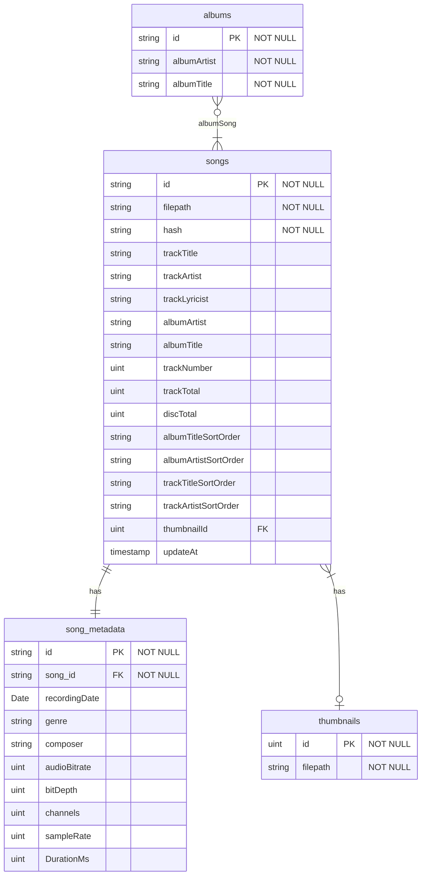

```mermaid
erDiagram
    songs ||--|| song_metadata : has
    albums }o--|{ songs : "albumSong"
    songs }|--o| thumbnails : has

    songs {
        string id PK "NOT NULL"
        string filepath "NOT NULL"
        string hash "NOT NULL"
        string trackTitle
        string trackArtist
        string trackLyricist
        string albumArtist
        string albumTitle
        uint trackNumber
        uint trackTotal
        uint discTotal
        string albumTitleSortOrder
        string albumArtistSortOrder
        string trackTitleSortOrder
        string trackArtistSortOrder
        uint thumbnailId FK
        timestamp updateAt
    }

    song_metadata {
        string id PK "NOT NULL"
        string song_id FK "NOT NULL"
        Date recordingDate
        string genre
        string composer
        uint audioBitrate
        uint bitDepth
        uint channels
        uint sampleRate
        uint DurationMs
    }

    albums {
        string id PK "NOT NULL"
        string albumArtist "NOT NULL"
        string albumTitle "NOT NULL"
    }

    thumbnails {
        uint id PK "NOT NULL"
        string filepath "NOT NULL"
    }
```
